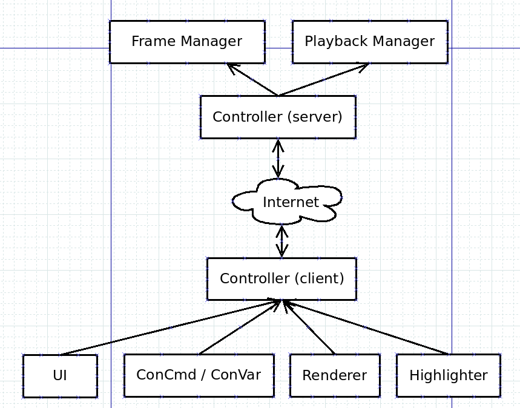

# Technical design of Stop Motion Helper

SMH code should follow these basic principles:

 - Code should be as client-authoritive as possible, all logic that can sensibly be done in client, should be
 - Communication between modules and client-server communication should happen through the Controller
 - SMH should not be dependent on any other addons, and support for other addons should be completely conditional

## Architecture overview



The central piece of SMH code architecture is the Controller. It is responsible for communication between modules and client/server.
It also stores the state and settings, so that it is accessible by all modules.

For example, say we issue the console command `smh_next`:
 - Concommand module invokes controller to move to next frame
 - Controller calculates what the next frame is (is it current+1 or back to first frame?)
 - Controller sends "set frame" command to server
 - Server controller receives command and invokes keyframe manager to configure entities
 - Server sends an ack message back to client
 - Client controller invokes an event corresponding to the ack
 - UI listens to the event and moves the playhead to the correct position

## Module details

### Server

 - **Controller** - Communicate with clients, receive requests from clients
 - **KeyframeManager** - Create, update and delete keyframes for players
 - **PlaybackManager** - Position entities for keyframe playback
 - **KeyframeData** - Data container for keyframes

### Client

 - **Controller** - Communicate with server, send commands to server
 - **Highlighter** - Render currently selected entity halo
 - **Renderer** - Screenshot rendering
 - **ConCommands** - Register and handle console commands
 - **UI** - Derma UI setup and logic
 - **Settings** - Register and handle settings (console variables)
 - **KeyframeData** - Data container for keyframes
 - **State** - Data container for client state (frame position, playback settings)

## Keyframe data

On serverside, a keyframe consists of
 - Keyframe ID, a shared unique identifier of the keyframe
 - Frame, aka position of the keyframe
 - Easing data
 - Modifier data, aka entity state data for the keyframe

Whenever updated keyframe data is sent to client, Modifier data is omitted. The client has to separately ask for modifier data to use for saving or ghost rendering.

KeyframeData stores keyframes in the following format:

```lua
{
    [player] = {
        Keyframes = {
            [ID] = [keyframe]
        },
        Entities = {
            [Entity] = {
                [keyframe]
            }
        }
    }
}
```

Keyframes can be used to lookup keyframe data with it's ID, and Entities can be used to lookup keyframe data for a specific entity. Both reference the same data (the same Lua table).
